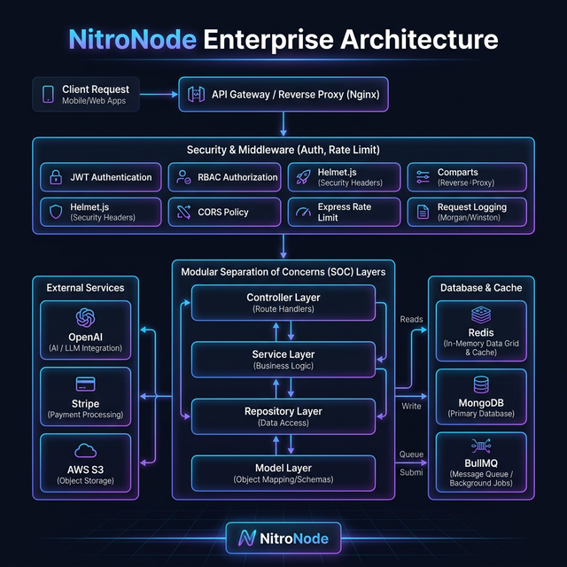

# NitroNode-Enterprise 🚀

**NitroNode-Enterprise** is a production-grade, industrial-strength Node.js foundation designed for high-scale SaaS and AI applications. It implements a strict layered architecture and professional security protocols that go far beyond standard boilerplates.

[](https://expressjs.com/)
[](https://nodejs.org/)
[](https://www.mongodb.com/)
[](https://redis.io/)

---

## 🧠 Why NitroNode? (The Philosophy)

The goal of this repository is to solve the "spaghetti code" problem often found in growing Node.js applications. By enforcing **Separation of Concerns (SoC)** and **Layered Architecture**, NitroNode ensures that your codebase remains maintainable even as it scales to millions of users.

### 📐 Architecture Diagram



### 🏗️ Why Layered Architecture?
Most developers mix business logic with routes or controllers. NitroNode enforces a strict one-way flow:
- **Route**: Only handles URL mapping.
- **Controller**: Thin layer that extracts request data and returns a response. **No business logic here.**
- **Service**: The brain of the app. All business rules, AI logic, and calculations live here.
- **Repository**: The only layer allowed to talk to the Database. This allows you to swap databases or mock data for testing with zero friction.
- **Model**: Pure data schema definition.

### 🛡️ Why Joi for Validation?
Input validation is the first line of defense. We use `Joi` because:
- **Schema-first**: It ensures that only specifically formatted data enters your services.
- **Type Safety**: Prevents common runtime errors caused by unexpected data types.
- **Detailed Errors**: Provides clear, user-friendly feedback on what's missing or wrong.

### ⚡ Why Redis for Security?
Security is not just about passwords; it's about availability.
- **Rate Limiting**: Prevents DDoS and brute-force attacks by limiting requests per IP.
- **IP Blocking**: Automatically identifies and bans malicious IPs that fail multiple logins, reducing server load from bot attacks.
- **Token Blacklisting**: Allows for high-security logout scenarios where tokens must be invalidated before they expire.

### 📬 Why BullMQ for Background Tasks?
Complex apps should never make the user wait for side effects like sending emails or processing AI.
- **Reliability**: If a mail server is down, BullMQ handles retries automatically with exponential backoff.
- **Performance**: Moves heavy computation (like PDF parsing or AI calls) out of the main request-response cycle.
- **Scalability**: Workers can be scaled independently of the main API.

### 🐳 Why Docker?
"It works on my machine" is not an option for enterprise.
- **Environment Parity**: Ensures the exact same versions of Node, MongoDB, and Redis are used across development, staging, and production.
- **Isolation**: Prevents dependency conflicts with other projects on your local machine.

### 📝 Why Swagger (OpenAPI)?
The API is only as good as its documentation.
- **Interactive**: Frontend developers can test endpoints directly from the browser without needing Postman.
- **Standardized**: Follows the industry-standard OpenAPI 3.0 specification.
- **Sync**: Documentation stays in sync with your actual code via JSDoc decorators.

---

## 🚀 Key Features

### 🛡️ Core Security & Auth
- **JWT Advanced Flow**: Secure Access & Refresh token management.
- **Granular RBAC**: Role-Based Access Control + per-action Permissions.
- **Super-Admin Override**: Maintainer-level global access.
- **Secure by Default**: `Helmet`, `HPP`, `XSS-Clean`, and `Mongo-Sanitize` are pre-configured.

### 🤖 Built-in AI & RAG Engine
- **OpenAI Integration**: Pre-wired for Chat Completions and Embeddings.
- **RAG System**: Retrieval-Augmented Generation logic with PDF parser support.
- **Background Processing**: High-performance task queue powered by **BullMQ**.

### 🛠️ Infrastructure & Scale
- **Swagger Documentation**: Self-documenting API at `/api-docs`.
- **Advanced Health Checks**: Dependency-aware system vitals (DB & Redis status).
- **Dockerized**: Dedicated `Dockerfile` and `docker-compose.yml` for instant deployment.
- **Multer Storage**: Multi-cloud support for **AWS S3** and **Cloudinary**.
- **Stripe Payments**: Enterprise-ready billing and webhook integration.
- **Automated Usage Tracking**: Global middleware to track per-user API consumption.
- **Data Export**: Built-in CSV/Excel generation utility.
- **Audit System**: Every critical action is tracked for compliance.

### 💎 Developer Experience (DX)
- **Linting & Formatting**: Pre-configured **ESLint** and **Prettier** for code consistency.
- **Type-Safe validation**: Joi schemas for every endpoint.
- **Automated Testing**: **Jest** and **Supertest** setup for integration testing.
- **Git Hooks Ready**: Structure prepared for Husky and lint-staged.

---

## 📁 Project Structure

```text
src/
├── app.js              # Express app definition & security middleware
├── server.js           # Server bootstrap, DB connections, & graceful shutdown
├── common/             # constants, custom ApiError, and API Response formatters
├── config/             # Environment validation, DB, Redis, and Winston logger
├── cron/               # Scheduled background tasks (IP cleanup, Usage resets)
├── modules/            # Domain-driven feature modules (Auth, User, Audit, Usage)
│   └── [feature]/
│       ├── *.controller.js   # Thin handlers
│       ├── *.service.js      # Business Logic
│       ├── *.repository.js   # DB Operations
│       ├── *.model.js        # Schema
│       ├── *.validation.js   # Joi Schemas
│       └── index.js          # Feature Router
├── services/           # External API wrappers (AI, RAG, Stripe, S3)
└── routes/v1/          # Master entry point for all versioned routes
```

---

## 🛠️ Getting Started

1. **Clone & Install**:
   ```bash
   git clone https://github.com/Ankit8412226/NitroNode-Enterprise.git
   cd NitroNode-Enterprise
   npm install
   ```

2. **Environment Setup**:
   Copy `.env.example` to `.env` and fill in your keys.

3. **Run for Development**:
   ```bash
   npm run dev
   ```

4. **Docker Deployment**:
   ```bash
   docker-compose up --build
   ```

---

## 📜 Coding Standards
- **Zero console.log**: All logs must go through the Winston logger.
- **Thin Controllers**: Move every ounce of logic to a service.
- **Chained Routes**: Always use `router.route()` for clean, grouped API definitions.
- **Prod Mode Safety**: Stack traces are never leaked to the client in production.

---

## 🤝 Contribution
This project is built for the community. If you have any feature requests or found a security vulnerability, please open an issue or submit a PR.
